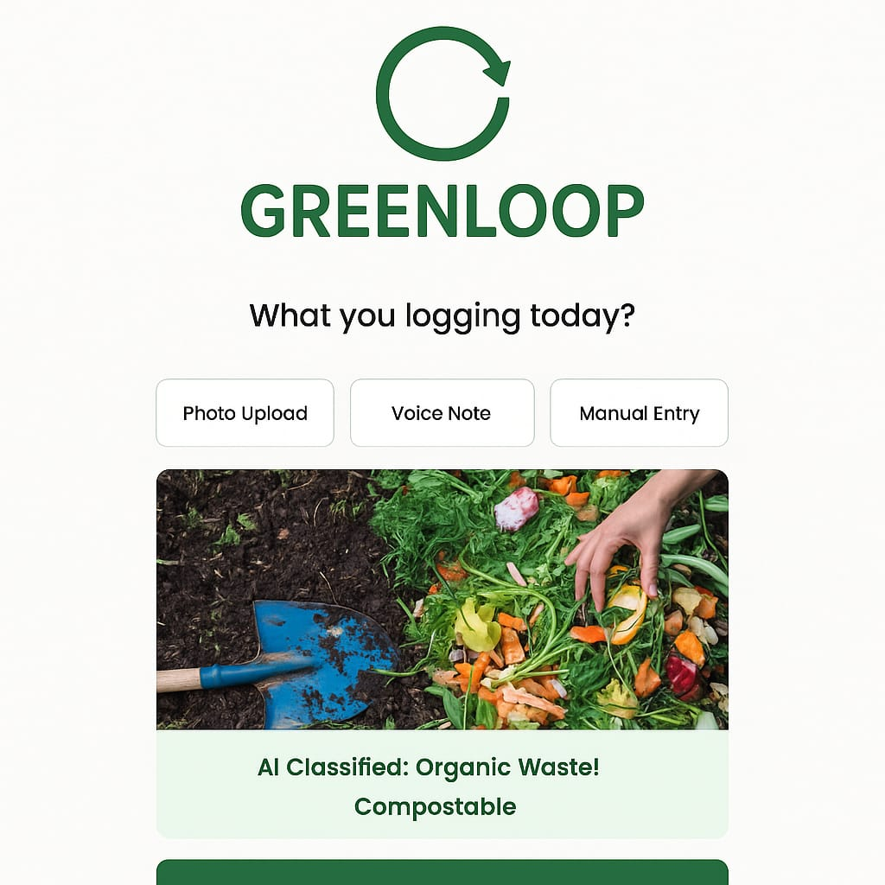

# 🚀 Afsar Azam (Stegan) — Advanced Portfolio

<div align="center">
  
  <h1 style="color: #00ffff; font-weight: bold;">Afsar Azam (Stegan)</h1>
  <p style="font-size: 1.2em; color: #cccccc;">AI & Data Science Developer | Python Enthusiast | Tech Innovator</p>
  <p style="font-size: 1em; color: #b5b5b5;">Building intelligent systems that solve real-world problems with data and AI.</p>
  <br>
  <a href="https://afsar426.github.io/adv-portfolio-/" target="_blank">
    
  </a>
  <a href="https://github.com/Afsar426/adv-portfolio-/issues">
    
  </a>
  <a href="https://github.com/Afsar426/adv-portfolio-/pulls">
    
  </a>
  <a href="https://github.com/Afsar426/adv-portfolio-/blob/main/LICENSE">
    
  </a>
</div>

---

## 📋 Table of Contents

- [🌟 About This Portfolio](#-about-this-portfolio)
- [✨ Key Highlights](#-key-highlights)
- [🛠️ Tech Stack](#️-tech-stack)
- [📋 Features](#-features)
- [📸 Screenshots](#-screenshots)
- [🚀 Installation & Setup](#-installation--setup)
- [📊 Project Structure](#-project-structure)
- [🤝 Contributing](#-contributing)
- [📄 License](#-license)
- [📞 Contact](#-contact)
- [🎉 Acknowledgments](#-acknowledgments)

---

## 🌟 About This Portfolio

<div align="center">
  
</div>

Welcome to my personal portfolio! This is a modern, interactive React-based website showcasing my journey as an AI & Data Science developer. From innovative projects like AI-powered financial assistants to sustainable tech solutions, explore my work, skills, and achievements.

I'm **Afsar Azam (Stegan)**, a passionate AI & Data Science Developer currently pursuing B.Tech in Artificial Intelligence at SAGE University, Indore. My expertise spans data analysis, machine learning, UI/UX development, and creating intelligent systems that make a real impact.

### ✨ Key Highlights

<div align="center">
  <table>
    <tr>
      <td align="center">
        
        <br><strong>Modern UI/UX</strong>
      </td>
      <td align="center">
        
        <br><strong>Fully Responsive</strong>
      </td>
      <td align="center">
        
        <br><strong>Smooth Animations</strong>
      </td>
      <td align="center">
        
        <br><strong>Live on GitHub Pages</strong>
      </td>
    </tr>
  </table>
</div>

- **🎨 Modern UI/UX**: Built with React, Framer Motion, and custom CSS for smooth animations and responsive design.
- **📱 Fully Responsive**: Optimized for desktop, tablet, and mobile devices.
- **🔧 Advanced Tech Stack**: React, Vite, Framer Motion, D3.js, EmailJS, and more.
- **🚀 Deployed**: Live on GitHub Pages at [https://afsar426.github.io/adv-portfolio-/](https://afsar426.github.io/adv-portfolio-/).
- **📂 Comprehensive Sections**: Home, About, Projects, Gallery, Certificates, Skills, Blog, Resume, Contact.

---

## 🛠️ Tech Stack

<div align="center">
  
  
  
  
  
  
  
  <br>
  
  
  
  
  
  
  
</div>

---

## 📋 Features

### 🏠 Home
- **🎭 Animated Introduction**: Typing effect and floating photo with glowing borders.
- **🏷️ Profession Tags**: Dynamic tags showcasing expertise in AI, Data Science, and Development.
- **🔗 Quick Links**: Direct links to GitHub, LinkedIn, Email, WhatsApp, Instagram, Facebook.
- **📋 Info Cards**: Location, expertise, and contact details with hover effects.

### 👨‍💻 About
- **📖 Personal Bio**: Background in AI & Data Science, current studies at SAGE University.
- **🎓 Education Timeline**: Higher Secondary and Secondary education details with icons.
- **💡 Skills Overview**: Programming, web tech, AI/ML, data science, tools.

### 🚀 Projects
Showcase of key projects:

| Project | Description | Tech Stack | Links |
|---------|-------------|------------|-------|
| 🧠 **MyMoneyMentor-AI** | AI financial planner with expense tracking and recommendations | Python, Pandas, Flask, HTML, CSS | [Code](https://github.com/Afsar426) |
| 🌱 **GreenLoop** | Sustainable gardening platform using ML for compost monitoring | Python, TensorFlow, React, Firebase | [Code](https://github.com/Afsar426) |
| 🎙️ **Jarvis** | Voice assistant for automation tasks | Python, SpeechRecognition, pyttsx3 | [Code](https://github.com/Afsar426) |
| 📊 **COVID-19 Trend Analysis** | Data visualization and prediction | Python, Pandas, Matplotlib, Prophet | [Code](https://github.com/Afsar426) |
| 🎬 **Netflix Data Analysis** | EDA on content patterns | Python, Pandas, Matplotlib, Seaborn | [Code](https://github.com/Afsar426) |
| 🛍️ **Amazon Data Analysis** | NLP for sentiment analysis | Python, Pandas, NumPy, NLTK | [Code](https://github.com/Afsar426) |
| 📚 **Library Management System** | C++ and MySQL-based system | C++, MySQL | [Code](https://github.com/Afsar426) |

Each project includes screenshots, tech stack badges, and links to code/live demos.

### 🖼️ Gallery
- **👤 Personal**: Travel photos, coding sessions, illustrations.
- **🚀 Projects**: Screenshots of project UIs.
- **🏆 Achievements**: Hackathon wins, awards, recognitions.
- **🔍 Interactive Zoom**: Click to enlarge images with navigation controls.

### 🏅 Certificates
- **💻 Tech**: Python for Data Science, AI Fundamentals, Web Development.
- **🏆 Others**: Hackathon Finalist, Project Excellence Award, Sustainable Innovation.
- **👁️ Modal Preview**: Click "View" to see full certificate images in modal.

### 💡 Skills
- **🎨 Visual Skills Grid**: Animated icons for Python, C++, JS, React, TensorFlow, etc.
- **📊 Detailed Table**: Categorized skills with descriptions and proficiency levels.
- **✨ Hover Effects**: Smooth animations and color changes on interaction.

### 📝 Blog
- **📚 Placeholder**: Ready for future blog posts on AI, data science, and tech trends.
- **📰 Categories**: AI Insights, Data Science Tutorials, Tech News.

### 📄 Resume
- **📑 Embedded PDF Viewer**: Downloadable resume with preview.
- **🔄 Auto-Update**: Easily update resume content.

### 📞 Contact
- **📧 Contact Form**: Integrated with EmailJS for seamless communication.
- **🌐 Social Media Links**: Direct links to all social platforms.
- **📍 Contact Info**: Address, phone, email with icons.

---

## 📸 Screenshots

<div align="center">
  <details>
    <summary><strong>🏠 Home Page</strong></summary>
    
  </details>
  <details>
    <summary><strong>🚀 Projects Section</strong></summary>
    
  </details>
  <details>
    <summary><strong>💡 Skills Visualization</strong></summary>
    
  </details>
</div>

---

## 🚀 Installation & Setup

### Prerequisites
- Node.js (v16 or higher)
- npm or yarn
- Git

### Quick Start

1. **Clone the Repository**:
   ```bash
   git clone https://github.com/Afsar426/adv-portfolio-.git
   cd adv-portfolio-
   ```

2. **Install Dependencies**:
   ```bash
   npm install
   ```

3. **Run Development Server**:
   ```bash
   npm run dev
   ```
   - Open [http://localhost:5174/adv-portfolio-/](http://localhost:5174/adv-portfolio-/) in your browser.

4. **Build for Production**:
   ```bash
   npm run build
   ```

5. **Preview Production Build**:
   ```bash
   npm run preview
   ```

6. **Deploy to GitHub Pages**:
   ```bash
   npm run deploy
   ```
   - Ensure GitHub Pages is set to deploy from the `gh-pages` branch.

### Environment Variables
Create a `.env` file in the root directory:
```env
VITE_EMAILJS_SERVICE_ID=your_service_id
VITE_EMAILJS_TEMPLATE_ID=your_template_id
VITE_EMAILJS_USER_ID=your_user_id
```

---

## 📊 Project Structure

```
adv-portfolio-/
├── 📁 public/
│   ├── 🖼️ assets/          # Images, PDFs, icons
│   ├── 🏅 certs/           # Certificate images
│   ├── 🖼️ gallery/         # Gallery photos
│   ├── 🗂️ logos/           # Tech stack logos
│   └── 📄 index.html       # Main HTML template
├── 📁 src/
│   ├── 🧩 components/      # Reusable components (Navbar, etc.)
│   ├── 📄 pages/           # Page components (Home, About, Projects, etc.)
│   ├── ⚛️ App.jsx          # Main app component with routing
│   ├── 🚀 main.jsx         # React entry point
│   └── 🎨 index.css        # Global styles and animations
├── 📁 dist/                # Production build output
├── 📋 package.json         # Dependencies and scripts
├── ⚙️ vite.config.mjs      # Vite configuration
├── 🤖 .github/             # GitHub Actions workflows
├── 📝 README.md            # Project documentation
└── 📋 TODO.md              # Development tasks
```

---

## 🤝 Contributing

<div align="center">
  
</div>

Contributions are welcome! Feel free to fork this repo and submit pull requests. Suggestions for improvements are always appreciated.

### How to Contribute

1. **Fork the Project**
2. **Create a Feature Branch**:
   ```bash
   git checkout -b feature/AmazingFeature
   ```
3. **Commit Your Changes**:
   ```bash
   git commit -m 'Add some AmazingFeature'
   ```
4. **Push to the Branch**:
   ```bash
   git push origin feature/AmazingFeature
   ```
5. **Open a Pull Request**

### Development Guidelines
- Follow the existing code style
- Add comments for complex logic
- Test your changes thoroughly
- Update documentation as needed

---

## 📄 License

This project is licensed under the MIT License - see the [LICENSE](LICENSE) file for details.

```
MIT License

Copyright (c) 2024 Afsar Azam (Stegan)

Permission is hereby granted, free of charge, to any person obtaining a copy
of this software and associated documentation files (the "Software"), to deal
in the Software without restriction, including without limitation the rights
to use, copy, modify, merge, publish, distribute, sublicense, and/or sell
copies of the Software, and to permit persons to whom the Software is
furnished to do so, subject to the following conditions:

The above copyright notice and this permission notice shall be included in all
copies or substantial portions of the Software.
```

---

## 📞 Contact

<div align="center">
  <a href="https://github.com/Afsar426">
    
  </a>
  <a href="https://www.linkedin.com/in/afsar-azam-426/">
    
  </a>
  <a href="mailto:afsuuai@gmail.com">
    
  </a>
  <a href="https://wa.me/+91XXXXXXXXXX">
    
  </a>
  <a href="https://www.instagram.com/afsar_azam/">
    
  </a>
  <a href="https://www.facebook.com/afsar.azam.426">
    
  </a>
</div>

<p align="center">
  <strong>📧 Email:</strong> afsuuai@gmail.com<br>
  <strong>📱 Phone:</strong> +91 XXXXX XXXXX<br>
  <strong>📍 Location:</strong> Indore, Madhya Pradesh, India
</p>

---

## 🎉 Acknowledgments

<div align="center">
  
</div>

- **React Community** for the amazing framework
- **Framer Motion** for smooth animations
- **Vite** for fast development experience
- **Open Source Contributors** for libraries and tools
- **Mentors and Teachers** for guidance and support
- **Friends and Family** for encouragement

---

<div align="center">
  
  
  
  
  <br>
  <p>© 2024 Afsar Azam (Stegan). Built with ❤️ using React and deployed on GitHub Pages.</p>
  <p>Made with passion for creating amazing user experiences! 🚀</p>
</div>
